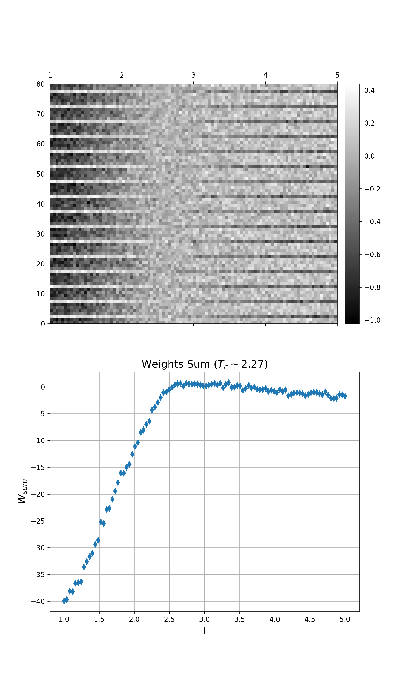

simple code for reproducing results of this [paper](https://arxiv.org/abs/1609.09087) (Detection of phase transition via convolutional neural network).

* [parallel_ising.py](parallel_ising.py) makes 2d Ising data by parallel processing.
* [train.ipynb](train.ipynb) includes a CNN model and some visualization.



## Dependencies
* Tensorflow 2.0.0 (keras 2.2.4)
* scikit-learn 0.21.3
* Pillow

## Example for making 2d ising data
```bash
python3 parallel_ising.py --lattice_size 16 --tempset 100
```
